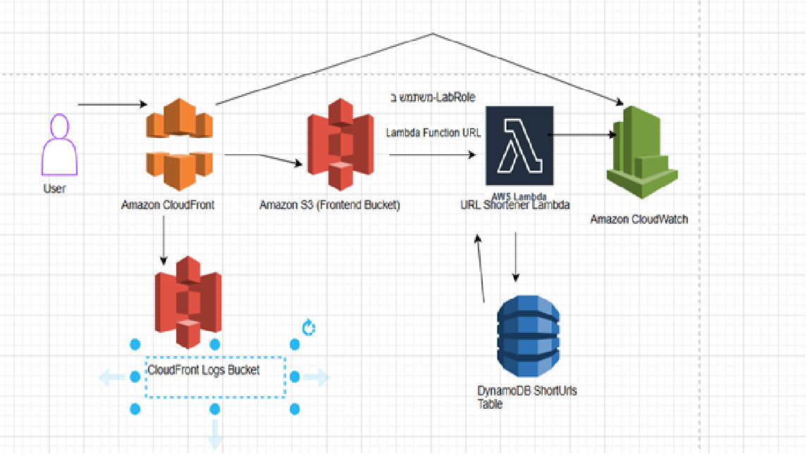
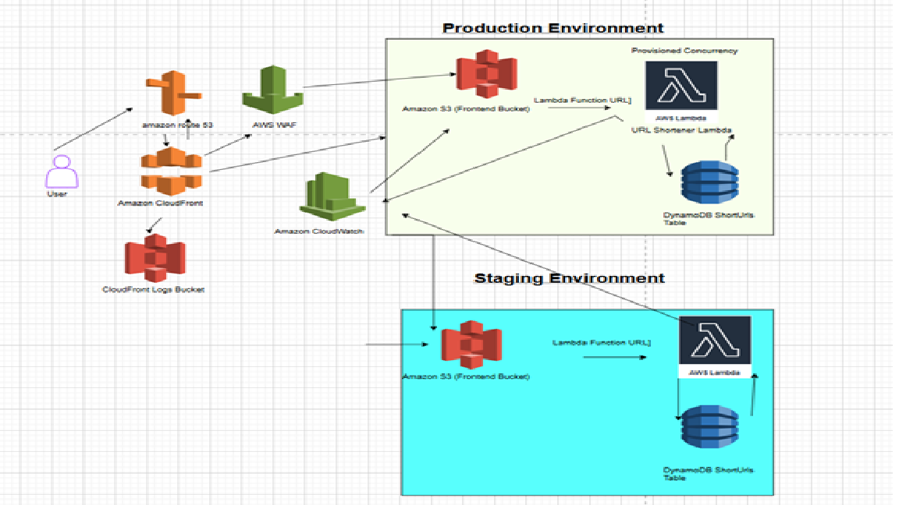

פרויקט מקצר כתובות URL ב-AWS
מבוא
פרויקט זה מציג יישום פשוט של מקצר כתובות URL (URL Shortener) המבוסס על שירותי Amazon Web Services (AWS) Serverless. הפרויקט מאפשר למשתמשים לקצר כתובות URL ארוכות ולקבל כתובות מקוצרות, אשר מפנות אוטומטית לכתובת המקורית בעת הגישה אליהן.

טכנולוגיות בשימוש:
AWS Lambda: פונקציה ללא שרתים (Serverless Function) המטפלת בלוגיקה העסקית של קיצור והפניית כתובות URL.

AWS DynamoDB: מסד נתונים NoSQL המשמש לאחסון הקישורים המקוריים והמקוצרים.

AWS S3: שירות אחסון אובייקטים המשמש לאירוח האתר הסטטי (Frontend) של מקצר הכתובות.

AWS CloudFront: רשת אספקת תוכן (CDN) המשמשת להגשת ה-Frontend במהירות וביעילות, עם תמיכה ביומני גישה.

AWS CloudWatch: שירות ניטור המשמש למעקב אחר מדדים ואזעקות עבור Lambda ו-CloudFront.

HTML, CSS (Tailwind CSS), JavaScript: עבור ממשק המשתמש (Frontend).

Python: עבור קוד ה-Backend של Lambda.

AWS CloudFormation: לטובת Infrastructure as Code (IaC) - הגדרת כל משאבי ה-AWS באמצעות קוד.

ארכיטקטורה
הארכיטקטורה של הפרויקט מורכבת מחלקים עיקריים:

Frontend (ממשק משתמש):

קובץ index.html סטטי המאוחסן ב-AWS S3.

מוגש דרך AWS CloudFront לביצועים ואבטחה משופרים.

מכיל טופס HTML לקליטת כתובת URL ארוכה וכפתור לקיצור.

משתמש ב-JavaScript כדי לשלוח בקשות POST לפונקציית ה-Lambda לקיצור כתובות, ומטפל בהצגת הקישור המקוצר.

Backend (לוגיקה עסקית):

פונקציית AWS Lambda (URLShortenerLambdaIaC) כתובה בפייתון.

מקבלת בקשות POST מה-Frontend לקיצור URL, מייצרת short_id ייחודי, ושומרת את הקישור המקורי והמקוצר ב-DynamoDB.

מקבלת בקשות GET ל-short_id (כאשר משתמש ניגש לקישור מקוצר), מאחזרת את ה-URL המקורי מ-DynamoDB, ומבצעת הפניה (Redirect) לדפדפן.

מוגדרת עם Function URL ועם הגדרות CORS מתאימות כדי לאפשר גישה מה-Frontend.

Database (מסד נתונים):

טבלת AWS DynamoDB (ShortUrlsIaC).

מפתח מחיצה (Partition Key) בשם id (מסוג String) המשמש כמזהה ייחודי לכל קישור מקוצר.

Logging & Monitoring:

S3 Logging Bucket: Bucket נפרד לאחסון יומני גישה של CloudFront.

CloudWatch Alarms: אזעקות מוגדרות לניטור שגיאות ב-Lambda וב-CloudFront (שגיאות 4xx ו-5xx).

הוראות הגדרה ופריסה
פרויקט זה מיושם באמצעות Infrastructure as Code (IaC) עם AWS CloudFormation. תבנית ה-CloudFormation תגדיר באופן אוטומטי את כל משאבי ה-AWS הנדרשים: טבלת DynamoDB, פונקציית Lambda, S3 Buckets (ל-Frontend וללוגים), CloudFront Distribution, ותפקידי IAM מתאימים, כולל אזעקות CloudWatch לניטור.

1. הכנת קובץ תבנית ה-CloudFormation
ודאו שיש לכם את קובץ התבנית בשם url-shortener-stack.yaml בתיקיית הפרויקט הראשית.

הערה: קובץ זה מכיל את כל ההגדרות של משאבי ה-AWS, כולל קוד ה-Python של פונקציית ה-Lambda המוטמע בתוכו.

2. פריסת ה-Stack באמצעות AWS CloudFormation
התחברו לקונסולת AWS (ודאו שאתם באזור US West (Oregon) / us-west-2).

עברו לשירות CloudFormation: חפשו "CloudFormation" בסרגל החיפוש.

צרו Stack חדש:

לחצו על "Create stack" -> "With new resources (standard)".

Specify template: בחרו "Upload a template file" ולחצו "Choose file".

נווטו ובחרו את הקובץ url-shortener-stack.yaml מהמחשב שלכם.

לחצו "Next".

הגדרת פרטי Stack:

Stack name: תנו שם ל-Stack, לדוגמה: URLShortenerAppStack.

Parameters:

ודאו את שמות ברירת המחדל של FrontendBucketName ו-LoggingBucketName. אם אתם נתקלים בשגיאת ייחודיות מאוחר יותר, תצטרכו לשנות אותם.

ניתן להשאיר את שאר הפרמטרים בברירות המחדל.

לחצו "Next".

אפשרויות Stack: השאירו ברירות מחדל ולחצו "Next".

סקירה ואישור:

גללו לתחתית הדף.

סמנו את תיבת הסימון: "I acknowledge that AWS CloudFormation might create IAM resources with custom names." (זה הכרחי).

לחצו "Create stack".

מעקב אחר יצירת ה-Stack:

ה-Stack יעבור לסטטוס "CREATE_IN_PROGRESS".

עברו ללשונית "Events" כדי לעקוב אחר התקדמות יצירת המשאבים.

המתנו עד שהסטטוס ישתנה ל-"CREATE_COMPLETE".

3. עדכון והעלאת קובץ ה-Frontend (index.html)
לאחר שה-CloudFormation Stack סיים להיבנות בהצלחה:

השיגו את ה-Lambda Function URL ואת שם ה-Frontend Bucket החדש:

ב-CloudFormation, עברו ללשונית "Outputs" של ה-URLShortenerAppStack.

העתיקו את הערך של LambdaFunctionUrlOutput.

העתיקו את הערך של FrontendS3Bucket.

עדכנו את קובץ index.html המקומי:

פתחו את קובץ index.html במחשב שלכם.

מצאו את השורה: const LAMBDA_FUNCTION_URL = 'YOUR_LAMBDA_FUNCTION_URL_HERE';

החליפו את YOUR_LAMBDA_FUNCTION_URL_HERE ב-URL שהעתקתם מ-CloudFormation Outputs.

שמרו את הקובץ.

העלו את קובץ index.html המעודכן ל-S3 Bucket החדש:

ב-AWS Console, עברו לשירות S3.

נווטו ל-Bucket שנוצר על ידי CloudFormation (השתמשו בשם שהעתקתם מ-FrontendS3Bucket).

בלשונית "Objects", לחצו "Upload" והעלו את קובץ index.html המעודכן (החליפו את הקובץ הקיים).

4. בדיקת הפרויקט
גישה לאתר:

ב-CloudFormation, עברו ללשונית "Outputs" של ה-URLShortenerAppStack.

העתיקו את הערך של CloudFrontDomainName.

פתחו דפדפן אינטרנט ונווטו לכתובת ה-URL הזו. האתר אמור להיטען.

קיצור כתובת URL:

הזינו כתובת URL ארוכה בשדה הקלט.

לחצו על כפתור "קצר כתובת URL".

ודאו שמופיע קישור מקוצר.

בדיקת הפניה מחדש:

העתיקו את הקישור המקוצר שנוצר.

פתחו כרטיסייה חדשה בדפדפן והדביקו את הקישור המקוצר.

ודאו שאתם מופנים אוטומטית לכתובת ה-URL המקורית.

אימות ב-DynamoDB:

ב-AWS Console, נווטו ל-DynamoDB -> Tables -> ShortUrlsIaC (או השם שבחרתם בפרמטר DynamoDBTableName).

עברו ללשונית "Explore items".

ודאו שפריט חדש נוסף לטבלה עם ה-ID הקצר וה-URL המקורי.

בדיקת לוגים ב-S3:

ב-AWS Console, נווטו ל-S3 -> Buckets -> url-shortener-logs-maysabag-iac-2025 (או השם שבחרתם בפרמטר LoggingBucketName).

עברו ללשונית "Objects".

ודאו שאתם רואים קבצי לוגים חדשים שנוצרו בתוך תיקיית cloudfront-logs/.

בדיקת אזעקות ב-CloudWatch:

ב-AWS Console, נווטו ל-CloudWatch -> Alarms.

ודאו שאתם רואים את האזעקות שנוצרו על ידי ה-Stack (עבור Lambda Errors, CloudFront 4xx, 5xx).

(כדי להפעיל אזעקה, תוכלו לנסות לגרום לשגיאה ב-Lambda או ב-CloudFront, לדוגמה, על ידי ניסיון קיצור URL לא חוקי).

צילומי מסך
תיקיית screenshots בפרויקט זה מכילה את צילומי המסך המתעדים את שלבי ההגדרות והבדיקות השונים ב-AWS Console ובדפדפן. צילומי המסך מסודרים לפי שלבי ההקמה והבדיקה:

חלק 1: הקמה ידנית (אם רלוונטי)

Part1_1_DynamoDB_CreateTable_Config.png

Part1_2_Lambda_CreateFunction_Config.png

Part1_3_Lambda_FunctionURL_CORS_Config.png

Part1_4_Lambda_FunctionURL_Copied.png

Part1_5_Lambda_Environment_Variables_Config.png

Part1_6_S3_CreateBucket_Config.png

Part1_7_S3_Static_Website_Hosting_Config.png

Part1_8_S3_Website_Endpoint.png

Part1_9_S3_Upload_Index_HTML.png

Part1_10_S3_Bucket_Policy_Config.png

Part1_11_URL_Shortener_Frontend_Loaded.png

Part1_12_URL_Shortened_Success.png

Part1_13_Redirect_Successful.png

Part1_14_DynamoDB_Entry_Verified.png

Part1_15_Network_Tab_Error.png (אם נתקלת בשגיאות רשת)

Part1_16_Network_Response_Error.png (אם נתקלת בשגיאות רשת)

חלק 2: הקמה באמצעות IaC ובדיקות

Part2_1_Project_Folder_With_CloudFormation.png

Part2_2_HTML_Lambda_URL_Placeholder.png

Part2_3_Project_Screenshots_Folder.png

Part2_4_CloudFormation_Stack_Details.png

Part2_5_CloudFormation_Review_And_Acknowledge.png

Part2_6_CloudFormation_Stack_Create_Complete.png

Part2_7_CloudFormation_Outputs_Lambda_URL_Frontend_Bucket.png

Part2_8_S3_Upload_Updated_Index_HTML_to_New_Bucket.png

Part2_9_CloudFront_Website_Loaded.png

Part2_10_URL_Shortened_Via_CloudFront.png

Part2_11_Redirect_Successful_Via_CloudFront.png

Part2_12_DynamoDB_Entry_Verified_IaC.png

Part2_13_S3_CloudFront_Logs_Bucket.png

Part2_14_CloudWatch_Alarms_Overview.png

שלבי Git (אם רלוונטיים להגשה)

Git_Create_Repo_No_README_Config.png

Git_New_Repo_URL_Copied.png

Git_Push_New_Repo_Success.png

GitHub_New_Repo_Files_Uploaded_Final.png

Git_Push_README_Success.png

GitHub_Repo_With_README.png

פתרון מגבלות סביבת Sandbox
במהלך פיתוח הפרויקט בסביבת ה-Sandbox, נתקלנו במגבלות הרשאה מסוימות, כגון חוסר יכולת ליצור או לשנות מדיניות IAM באופן ישיר. התמודדנו עם מגבלות אלו באופן יצירתי:

שימוש ב-LabRole קיים: במקום ליצור תפקידי IAM מותאמים אישית, השתמשנו בתפקיד ה-LabRole הקיים עבור פונקציית ה-Lambda.

אישור IAM ב-CloudFormation: בתבנית ה-CloudFormation, אישרנו במפורש את היכולת של CloudFormation ליצור משאבי IAM (כמו תפקיד הביצוע של Lambda) עם שמות מותאמים אישית, מה שאפשר את פריסת התשתית למרות מגבלות ה-Sandbox.

התמודדות עם שגיאות CORS: שגיאות CORS (Cross-Origin Resource Sharing) היוו אתגר משמעותי. הן נפתרו על ידי הגדרה מדויקת של כותרות CORS ב-Function URL של Lambda, וכן על ידי הבטחת סנכרון נכון של קובץ ה-index.html עם ה-URL המעודכן של Lambda.

אתגר ניטור מתקדם: שילוב Grafana או Prometheus
כאתגר מתקדם, נבחן כיצד ניתן לשלב את Grafana או Prometheus כדי לדמיין מדדים מ-Lambda ומ-CloudFront.

הצעת אינטגרציה:
איסוף מדדים מ-CloudWatch:

CloudWatch Metrics: גם Lambda וגם CloudFront שולחים מדדים אוטומטית ל-CloudWatch (לדוגמה, Errors, Invocations עבור Lambda; 4xxErrorRate, 5xxErrorRate, Requests עבור CloudFront).

CloudWatch Logs: ניתן גם לנתח לוגים מ-S3 (יומני גישה של CloudFront) או מ-CloudWatch Logs (יומני Lambda) כדי לחלץ מדדים מותאמים אישית.

הזנת מדדים ל-Grafana או Prometheus:

Grafana: Grafana תומכת בחיבור ישיר ל-CloudWatch כמקור נתונים. ניתן להגדיר Dashboards ב-Grafana שיציגו גרפים ונתונים בזמן אמת ממדדי ה-CloudWatch של Lambda ו-CloudFront.

Prometheus: כדי לשלב את Prometheus, נצטרך "exporter" שימשוך נתונים מ-CloudWatch ויחשוף אותם בפורמט ש-Prometheus יכולה לצרוך. לדוגמה, cloudwatch_exporter יכול לשלוף מדדים מ-CloudWatch ולהפוך אותם לזמינים עבור Prometheus.

תרחיש תיאורטי:
היינו מקימים שרת Grafana (לדוגמה, על EC2 Instance) ומחברים אותו ל-CloudWatch באמצעות ה-AWS SDK ו-IAM Role מתאים. ב-Grafana, היינו יוצרים Dashboard עם פאנלים המציגים:

מספר קריאות ל-Lambda.

שיעור שגיאות Lambda.

שיעור שגיאות 4xx ו-5xx ב-CloudFront.

כמות בקשות ל-CloudFront.
זה יאפשר ניטור ויזואלי של ביצועי המערכת ובריאותה.

שרטוט ארכיטקטורה (רמה גבוהה)
[כאן יש להוסיף דיאגרמת ארכיטקטורה של המערכת שבניתם ב-AWS Sandbox.]

הוראות ליצירת הדיאגרמה:

השתמשו בכלי כמו draw.io, Lucidchart, Miro, או אפילו PowerPoint/Google Slides.

כללו את כל השירותים הבאים:

משתמש (User)

Amazon CloudFront (מצביע על S3 Frontend)

Amazon S3 (Bucket עבור Frontend)

AWS Lambda (פונקציית ה-URL Shortener)

Lambda Function URL (החיבור בין Frontend ל-Lambda)

Amazon DynamoDB (טבלת ShortUrls)

Amazon S3 (Bucket עבור CloudFront Logs)

Amazon CloudWatch (עבור מדדים ואזעקות של Lambda ו-CloudFront)

השתמשו באייקונים הרשמיים של AWS במידת האפשר.

ציירו קווים המחברים בין השירותים כדי להראות את זרימת הנתונים והתקשורת (לדוגמה: משתמש -> CloudFront -> S3, Frontend -> Lambda Function URL -> Lambda -> DynamoDB).

הדגשת התאמות ל-Sandbox: ציינו באופן ויזואלי או בטקסט קצר ליד הדיאגרמה אם היו התאמות ספציפיות בגלל מגבלות ה-Sandbox (לדוגמה, אם הייתם צריכים להשתמש ב-LabRole ספציפי).

לאחר יצירת הדיאגרמה, שמרו אותה כקובץ תמונה (לדוגמה, architecture_sandbox.png) בתיקיית screenshots של הפרויקט.

כדי להציג את הדיאגרמה ב-README.md, החליפו את השורה [כאן יש להוסיף דיאגרמת ארכיטקטורה של המערכת שבניתם ב-AWS Sandbox.] בשורה הבאה:

שירותים לכלול בדיאגרמה:

S3 (Frontend Bucket)

Lambda (עם Function URL)

DynamoDB

CloudFront

CloudWatch (כולל Alarms)

S3 Logging Bucket

הדגשת התאמות ל-Sandbox: יש לציין בדיאגרמה (או בתיאור מתחתיה) כל התאמה שנעשתה עקב מגבלות ה-Sandbox (לדוגמה, שימוש ב-LabRole קיים).

ארכיטקטורה מלאה ללא מגבלות Sandbox (בונוס) (screenshots/architecture_full.png)
אם הייתה לנו גישה מלאה ל-AWS, היינו משפרים את הארכיטקטורה באופן הבא:

ניהול דומיינים מותאמים אישית: שימוש ב-Route 53 לניהול דומיין מותאם אישית (לדוגמה, short.yourdomain.com) והצמדתו ל-CloudFront Distribution.

אבטחה משופרת: הוספת AWS WAF (Web Application Firewall) מול CloudFront כדי להגן מפני מתקפות נפוצות (כגון SQL Injection, Cross-Site Scripting).

אופטימיזציה של Lambda: שיפור הגדרות ה-Scaling של Lambda (לדוגמה, Provisioned Concurrency לזמני תגובה מהירים יותר).

סביבות נפרדות: הקמת סביבות Staging ו-Production נפרדות באמצעות CloudFormation Stacks נפרדים, כדי לאפשר בדיקות בטוחות לפני פריסה לייצור.

[כאן יש להוסיף דיאגרמת ארכיטקטורה משופרת ללא מגבלות Sandbox.]

הוראות ליצירת הדיאגרמה:

השתמשו באותו כלי ליצירת דיאגרמות.

כללו את כל השירותים מהדיאגרמה הקודמת, בתוספת:

Amazon Route 53 (לניהול דומיין מותאם אישית)

AWS WAF (מול CloudFront)

סביבות Staging/Production נפרדות (ניתן להציג זאת על ידי שכפול חלק מהארכיטקטורה או שימוש בתיבות/צבעים שונים).

שיפורי Lambda Scaling (ניתן לציין בטקסט או להוסיף אלמנט קטן המציין זאת).

הדגישו את השיפורים הללו בדיאגרמה.

לאחר יצירת הדיאגרמה, שמרו אותה כקובץ תמונה (לדוגמה, architecture_full.png) בתיקיית screenshots של הפרויקט.

כדי להציג את הדיאגרמה ב-README.md, החליפו את השורה [כאן יש להוסיף דיאגרמת ארכיטקטורה משופרת ללא מגבלות Sandbox.] בשורה הבאה:

אתגר טכני שנתקלתי בו
במהלך הפרויקט, נתקלתי באתגר טכני משמעותי עם שגיאות CORS (Cross-Origin Resource Sharing).

תיאור האתגר: כאשר ניסיתי לשלוח בקשות מה-Frontend (המאוחסן ב-S3) לפונקציית ה-Lambda, הדפדפן חסם את הבקשות עם הודעת שגיאה "No 'Access-Control-Allow-Origin' header is present". זה קרה למרות שהגדרתי את ה-CORS ב-Function URL של Lambda. הבעיה נבעה מכך שהדפדפן שולח בקשת "preflight" (OPTIONS) לפני הבקשה העיקרית, ודורש כותרות CORS בתגובה לבקשה זו.

איך התגברתי עליו:

בדיקה חוזרת של הגדרות CORS ב-Lambda Function URL: ודאתי ש-Allow origins מוגדר ל-* (כוכבית), וכי Allow methods כולל OPTIONS בנוסף ל-GET ו-POST.

אימות כותרות: ודאתי שגם Allow headers כולל Content-Type, X-Amz-Date, ו-Authorization.

רענון קאש הדפדפן: ביצעתי רענון חזק לדף (Ctrl+F5 / Cmd+Shift+R) כדי לוודא שהדפדפן לא משתמש בגרסה שמורה בקאש.

בדיקה ב-Network Tab: השתמשתי בלשונית "Network" בכלי המפתחים של הדפדפן כדי לראות את התגובה המלאה מה-Lambda ולזהות בדיוק אילו כותרות חסרות או שגויות.

מה הייתי עושה אחרת בפעם הבאה: הייתי מתחילה את אבחון בעיות ה-CORS ישירות בלשונית "Network" בכלי המפתחים, מכיוון שהיא מספקת את המידע המדויק ביותר על הבקשות והתגובות, ומאפשרת לזהות במהירות את הכותרות החסרות. כמו כן, הייתי מוודאת שפקודת OPTIONS כלולה ב-AllowMethods מההתחלה.